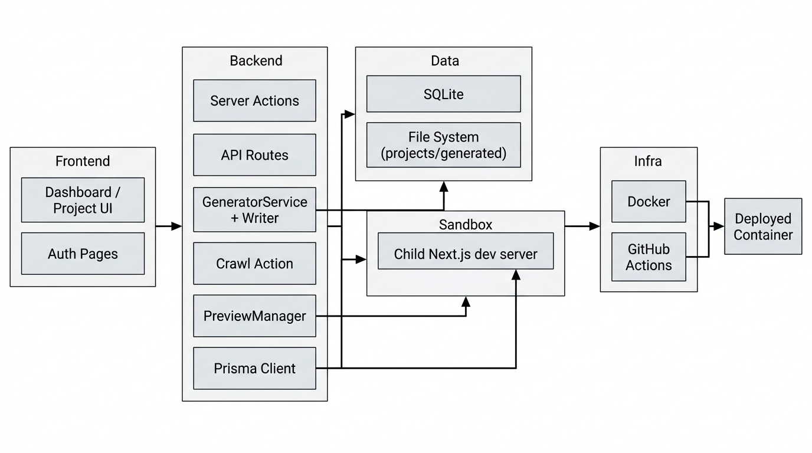

## Apivolt – Technical Architecture Documentation

### 1. Overview

Apivolt (ApiToAppGenerator) is a **Next.js App Router** application that lets users:

- Authenticate and manage **projects**
- **Upload or crawl** API documentation to obtain an **OpenAPI 3** spec
- Configure **LLM models and API keys**
- Run a **generation pipeline** that turns the OpenAPI spec into a complete Next.js app written by an LLM
- **Preview** the generated app in an isolated sandbox (child Next.js dev server) proxied through the main app
- **Download** the generated source as a ZIP

Core concerns:

- **Core app** (dashboard, projects, auth, settings)
- **Generation engine** (prompt compiler + LLM client + filesystem writer)
- **Preview sandbox** (child Next.js dev servers + proxy)
- **Persistence** (Prisma + SQLite)
- **CI/CD & Docker** (build, test, deploy)

---

### 2. High‑Level Architecture

#### 2.1 Component diagram

Key points:

- **Single Next.js app** hosts UI, server actions, and API routes.
- **Generation engine** lives in `src/lib/*` and writes to `projects/{projectId}/generated`.
- **PreviewManager** owns child processes for sandboxed previews (separate Next.js dev servers).
- **CI/CD** ensures lint, build, tests, Docker build & deploy.

---

### 3. Data Model (Prisma)

File: `prisma/schema.prisma`

- **User**
  - Fields: `id`, `email`, `password`, `name?`, timestamps
  - Relations: one‑to‑many `projects`
  - Used for authentication/ownership checks.

- **Project**
  - Fields:
    - `name`, optional `description`
    - `ownerId` (FK to `User`)
    - `openApiSpec?: string` – raw JSON string of OpenAPI spec
    - `llmConfig?: string` – JSON (model + apiKey overrides)
    - `targetApiConfig?: string` – JSON map of env vars for generated app
    - `status: "DRAFT" | "GENERATING" | "READY" | "ERROR"`
  - Relations:
    - `owner: User`
    - `enrichments: EndpointEnrichment[]`

- **EndpointEnrichment**
  - Fields: `method`, `path`, optional `description`, optional `instruction`
  - Relation: `projectId` → `Project`
  - Unique index on `(projectId, method, path)` – one enrichment per route.

This schema underpins **projects, enrichments, and LLM configuration** everywhere in the code.

---

### 4. Backend Modules

#### 4.1 LLM client & Prisma

- `src/lib/prisma.ts` – exports a singleton Prisma client used by server actions, routes, and generator.
- `src/lib/llm-client.ts` – wraps OpenAI / OpenRouter client creation:
  - `createLlmClient(config, maxTokens)` returns `{ client, model }`
  - `resolveLlmConfig(...)` merges default + project overrides

These modules isolate external dependencies (DB + LLM) from higher-level services.

#### 4.2 OpenAPI parsing & minification

- `src/lib/openapi-parser.ts`
  - `parseOpenApiSpec(content: string | object)` uses `@apidevtools/swagger-parser` to validate and dereference an OpenAPI spec.
  - Throws a friendly `Invalid OpenAPI Specification` error.

- `src/lib/openapi-minifier.ts`
  - `minifyOpenApiSpec(spec: any): any`
  - Deep-copies the spec and **strips non-essential token consumers**:
    - Removes `tags`, `externalDocs`, endpoint `summary/description/operationId`, parameter descriptions/examples, response descriptions/examples, schema descriptions/examples/defaults.
  - Recursively walks component schemas to strip docs but preserve structure.
  - Used to reduce context size before sending to the LLM.

#### 4.3 Prompt builder

- `src/lib/generation-prompt-builder.ts`
  - Types:
    - `EnrichmentLike`
    - `ProjectLike` (subset of Prisma `Project` fields relevant to prompting)
    - `GenerationPrompts` (`systemPrompt`, `userPrompt`)
  - `buildGenerationPrompts(project, spec)`:
    - Builds a **fixed, high-signal system prompt** describing:
      - Stack: Next 14 App Router, TS, Tailwind, Shadcn
      - Critical output rules: required files (`package.json`, `next.config.mjs`, `tsconfig`, `layout.tsx`, `page.tsx`, `lib/utils.ts`, etc.)
      - Strict usage rules: `"use client"` placement, env var bracket notation, avoiding `next/image` for external URLs, HTTPS only, special `<<<FILE:...>>>` block format.
    - Extracts **endpoint summaries**:
      - Iterates over `spec.paths`, builds bullet list: `- METHOD /path: description`.
    - Builds **env hint** from `project.targetApiConfig` keys: instructs model to use these env vars for auth.
    - Uses `minifyOpenApiSpec(spec)` and truncates JSON string to keep within a safe token budget (with fallback of dropping `components` if still too large).
    - Concatenates everything into a user prompt with project metadata, minified spec, endpoint descriptions, and per-route enrichments.

This module centralizes all **prompt engineering** logic.

#### 4.4 Generated project writer

- `src/lib/generated-project-writer.ts`
  - Encapsulates all filesystem writes into the generated project directory:
    - `new GeneratedProjectWriter({ projectId })`
    - `writeFromLlmOutput(text, project?)`
  - Responsibilities:
    - Compute `projectDir = /projects/{projectId}/generated`
    - Aggressively clear **old source** (`src`, `components`, `app`).
    - Parse LLM output blocks: `<<<FILE:path>>>...<<<END>>>`, writing each file under `projectDir` (autocorrect `next.config.ts` → `next.config.mjs`).
    - Enforce a **safe Next.js config**:
      - Delete `next.config.js/ts`.
      - Write `next.config.mjs` with `typescript.ignoreBuildErrors` and `eslint.ignoreDuringBuilds` to avoid runtime crashes from LLM errors.
    - Ensure **App Router only**:
      - Remove any `pages/` or `src/pages/` directories.
    - Normalize `package.json`:
      - Remove invalid Shadcn packages (`shadcn/ui`, etc.).
      - Force scripts: `"dev": "next dev"`, `"build": "next build"`, `"start": "next start"`.
      - Pin dependencies to **Next 14 + React 18** and related tooling; ensures no Next 15/16/Turbopack in sandboxes.
    - Ensure `tsconfig.json` exists with correct `@/*` path aliases.
    - Inject `targetApiConfig` into `.env.local` in the generated app (one `KEY="value"` per line).

This module is the **infrastructure boundary** between the LLM’s textual output and a runnable Next.js application.

#### 4.5 Generation service

- `src/lib/generator.ts`
  - `GeneratorService` orchestrates the **entire generation pipeline**:
    - Constructor: `(projectId: string, apiKey?: string, model: string = "gpt-4-turbo")`.
    - `generate()`:
      1. Loads `project` (including `enrichments`) via Prisma.
      2. Validates `openApiSpec` presence; parses it as JSON.
      3. Calls `buildGenerationPrompts(project, spec)` to get `systemPrompt` + `userPrompt`.
      4. Uses `createLlmClient(resolveLlmConfig(...))` to get `{ client, model }`.
      5. Calls `client.chat.completions.create` with low temperature for deterministic code.
      6. Extracts `generatedText` from the first choice.
      7. Instantiates a `GeneratedProjectWriter` and calls `writeFromLlmOutput(generatedText, project)`.
      8. Returns `{ success: true, message: "Generation complete" }` or throws.

This is the **core domain service** that ties DB, prompt building, LLM, and file writing into a single call.

#### 4.6 Preview sandbox

Preview logic is split across several small modules:

- `src/lib/preview-types.ts` – defines `PreviewStatus` and `PreviewInstance`.
- `src/lib/preview-state-store.ts` – in-memory map of preview instances (`get`, `set`, `update`).
- `src/lib/preview-port-allocator.ts` – `findAvailablePort` using `net.createServer` probing `127.0.0.1`.
- `src/lib/preview-project-preparer.ts` – `preparePreviewProject(instance, cwd)`:
  - Determines whether `npm install` is required by comparing timestamps.
  - Ensures `package.json`, `tsconfig.json`, `next.config.mjs`, `postcss.config.mjs`, and `tailwind.config.ts` are present and safe.
  - Pins dependencies to **Next 14 + React 18** and strips invalid dependencies.
  - Constructs a sanitized `childEnv` with `NODE_ENV=development`, `NEXT_TELEMETRY_DISABLED=1`, `npm_config_cache=/tmp/.npm-cache`, `HOME=/tmp`, and filters out `__NEXT*` and problematic `NEXT_*` variables.

- `src/lib/preview-manager.ts`
  - `getStatus(projectId): PreviewInstance | undefined`
  - `startPreview(projectId): PreviewInstance`
    - Kills existing preview process for this project (using `taskkill` on Windows).
    - Verifies `projects/{id}/generated` exists.
    - Allocates a free port, stores instance, and asynchronously calls `runInstallationAndStart`.
  - `runInstallationAndStart(instance, cwd)`:
    - Calls `preparePreviewProject`.
    - If `needsInstall`, nukes old `node_modules` and `package-lock.json`, then runs `npm install` with safe flags.
    - Clears `.next` cache.
    - Strips `--turbo`/`--turbopack` from the dev script.
    - Spawns `next dev` with sanitized `childEnv` and updates status based on stdout “ready” messages.
    - Logs all output to `preview.log` and sets `status` to `READY` / `ERROR` / `IDLE` on exit.
  - `stopPreview(projectId)`:
    - Kills the preview process tree and resets status to `IDLE`.

This subsystem encapsulates **sandbox stability** and **Docker quirks**, keeping generated apps isolated from the host.

---

### 5. Server Actions & API Routes

#### 5.1 Auth & user flows

- `src/app/api/auth/[...nextauth]/route.ts`
  - NextAuth v5 route for credentials-based authentication.
- `src/app/actions/auth.ts`
  - Server actions for login, registration, and logout, using Prisma + Zod.

#### 5.2 Project CRUD & configuration

- `src/app/actions/project.ts` – create/update/delete projects, enforcing ownership.
- `src/app/actions/config.ts` – manage `llmConfig` (model + API key).
- `src/app/actions/target-config.ts` – manage `targetApiConfig` (env vars for generated app).
- `src/app/actions/enrichment.ts` – CRUD for per-endpoint `EndpointEnrichment` records.

#### 5.3 Spec ingestion: upload & crawl

- `src/app/actions/upload.ts`
  - Accepts an uploaded OpenAPI file via `FormData`.
  - Uses `parseOpenApiSpec` for validation and normalization.
  - Serializes spec into `Project.openApiSpec` and populates enrichment skeletons.

- `src/app/actions/crawl.ts`
  - `crawlApiDocumentation(projectId, url, { model, apiKey }?)`:
    - Auth + ownership checks.
    - Fetches HTML from `url`, strips to text with `cheerio`.
    - Uses LLM to convert text to OpenAPI 3 JSON.
    - Validates with `parseOpenApiSpec`.
    - Saves to `openApiSpec` and updates enrichments.

#### 5.4 Generation trigger & status

- `src/app/actions/generate.ts` – server action:
  - Auth + ownership checks.
  - Validates API key presence.
  - Sets project status to `GENERATING`, runs `GeneratorService.generate()` synchronously.
  - Updates status to `READY` or `ERROR` and revalidates project path.

- `src/app/api/projects/[id]/generate/route.ts` – API route:
  - `POST`: fire-and-forget generation (returns `202` and updates status asynchronously).
  - `GET`: returns `{ status: project.status }` for polling.

#### 5.5 Preview API

- `src/app/api/projects/[id]/preview/route.ts`
  - `POST`: starts preview via `PreviewManager.startPreview`.
  - `GET`: returns latest preview instance (status + port + errorMessage?).
  - `DELETE`: stops preview.

- `src/app/api/preview-status/[projectId]/route.ts`
  - Lightweight status endpoint for public `/share/[projectId]` page.

---

### 6. Frontend (App Router) Structure

#### 6.1 Layouts & root pages

- `src/app/layout.tsx` – global HTML shell (ThemeProvider, fonts, Tailwind).
- `src/app/(auth)/layout.tsx` – shared auth layout (branding, minimal chrome).
- `src/app/(auth)/login/page.tsx`, `src/app/(auth)/register/page.tsx` – auth forms.
- `src/app/(dashboard)/layout.tsx` – authenticated layout (header, nav, theme).
- `src/app/page.tsx` – public landing page with hero, features, and Shadcn-based documentation accordion.

#### 6.2 Dashboard & projects

- `src/app/(dashboard)/dashboard/page.tsx`
  - Requires auth; redirects unauthenticated users to `/login`.
  - Lists user projects, status, and actions (Open, Delete, New Project).
  - Contains an embedded “How to use Apivolt” guide.

- `src/app/(dashboard)/projects/new/page.tsx` – new project creation form.

- `src/app/(dashboard)/projects/[id]/page.tsx`
  - Main project workspace:
    - Header: project title, status chip, description editor, `GenerateButton`, `DownloadButton` (when ready), and `DeleteProjectButton`.
    - If no spec:
      - Side-by-side **UploadSpecForm** and **CrawlDocForm**.
    - If spec exists:
      - Tabs:
        - `preview` – `PreviewPanel` + warning about sandbox vs local differences.
        - `download` – instructions and `DownloadButton`.
        - `api` – spec info and `EndpointList` with enrichments.
        - `settings` – `LlmConfigForm`, `TargetApiConfigForm`, stats, and Danger Zone.

- `src/app/share/[projectId]/page.tsx`
  - Public read-only preview:
    - Polls preview status.
    - Shows running/starting/installing/error state.
    - Renders iframe with proxied app when ready.

#### 6.3 Key components

- `UploadSpecForm` – upload OpenAPI spec and call `uploadOpenApiSpec`.
- `CrawlDocForm` – capture documentation URL + model + optional API key and call `crawlApiDocumentation`.
- `EndpointList` – display endpoints and enrichments for editing.
- `LlmConfigForm` – select LLM model and set project API key.
- `TargetApiConfigForm` – manage env vars injected into generated app.
- `PreviewPanel` – control and monitor sandbox previews, and copy public share link.
- `GenerateButton` – trigger generation and poll for status via `/api/projects/{id}/generate`.
- `DownloadButton` – navigate to `/api/projects/{id}/download` to download ZIP.
- `LogoutButton` – wraps `next-auth/react.signOut` and performs manual redirect to `/login`.

---

### 7. Testing

- `vitest.config.ts`:
  - `environment: 'jsdom'`, `globals: true`, setup via `src/test/setup.ts`.
  - `include: ['src/**/*.test.{ts,tsx}']`
  - `exclude: ['node_modules/**', '.next/**']` – avoids running compiled tests in `.next/standalone`.

- `src/test/setup.ts` – imports `@testing-library/jest-dom`.

Key tests:

- `src/lib/generator.test.ts` – validates `minifyOpenApiSpec` strips descriptions/examples while preserving structure.
- `src/components/project/download-button.test.tsx` – ensures button redirects to correct download endpoint.
- `src/components/auth/logout-button.test.tsx` – ensures `signOut` is called correctly and window location is updated.

---

### 8. CI/CD & Docker

- `.github/workflows/docker-ci.yml`
  - `test` job: `npm ci`, `npm run lint`, `npm run build`, `npm run test`.
  - `build-push` job: builds Docker image with Buildx and pushes `latest` and `sha` tags.
  - `deploy` job: SSHs into server, runs `docker-compose pull && docker-compose up -d --remove-orphans`, and prunes old images.

- `Dockerfile`
  - Multi-stage build with `node:20-slim`.
  - Uses non-root user `nextjs` (UID 1001).

- `docker-compose.yml`
  - Maps:
    - `./prisma/dev.db` → `/app/prisma/dev.db`
    - `./projects` → `/app/projects`
  - Exposes `3000` and `3100-3110` ports.

---

### 9. Security & Hardening

From `WALKTHROUGH.md` and the implementation:

- **SQL Injection** – all DB access via Prisma ORM, no raw SQL.
- **XSS** – no `dangerouslySetInnerHTML`, relying on JSX auto-escaping.
- **Payload limits** – Zod schemas with `.max()` on inputs and file uploads capped at 5MB.
- **Sandbox isolation** – strict child environment, no leaking of host `__NEXT_*` env, pinned toolchain to avoid Turbopack/Docker instability.

---

### 10. End-to-End Flow Summary

1. User logs in and creates a project.
2. User uploads an OpenAPI spec or provides a documentation URL for crawling.
3. Server actions store the validated spec and build/update `EndpointEnrichment` records.
4. User configures LLM model and target API env vars.
5. User triggers generation; `GeneratorService` builds prompts, calls the LLM, and writes a full Next.js app to `projects/{id}/generated`.
6. User starts a preview; `PreviewManager` spawns a child Next.js dev server bound to an isolated port with a safe environment.
7. Middleware and preview routes proxy traffic to the sandbox app, surfaced via dashboard `PreviewPanel` or public `/share/[projectId]`.
8. User downloads the generated code as a ZIP and runs it locally or deploys it elsewhere.

