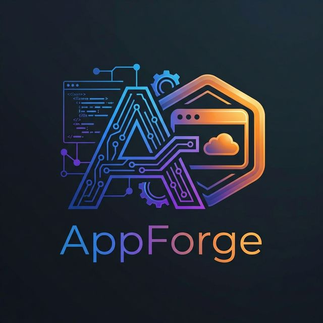
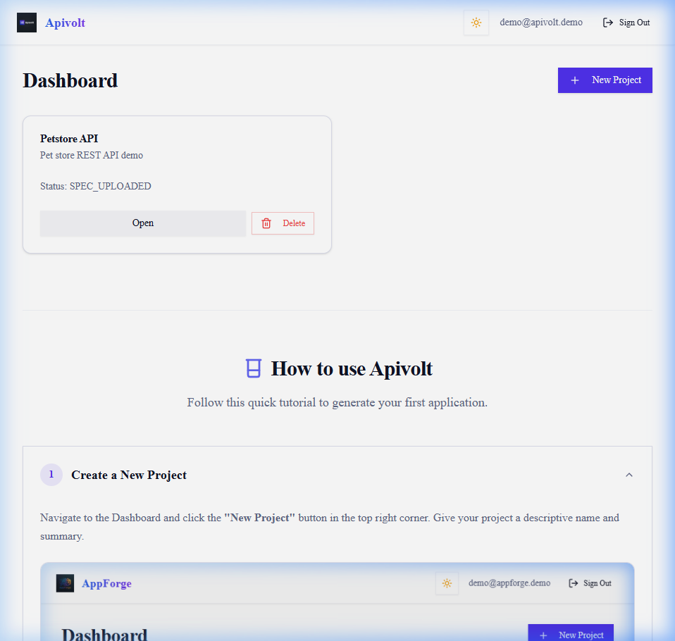
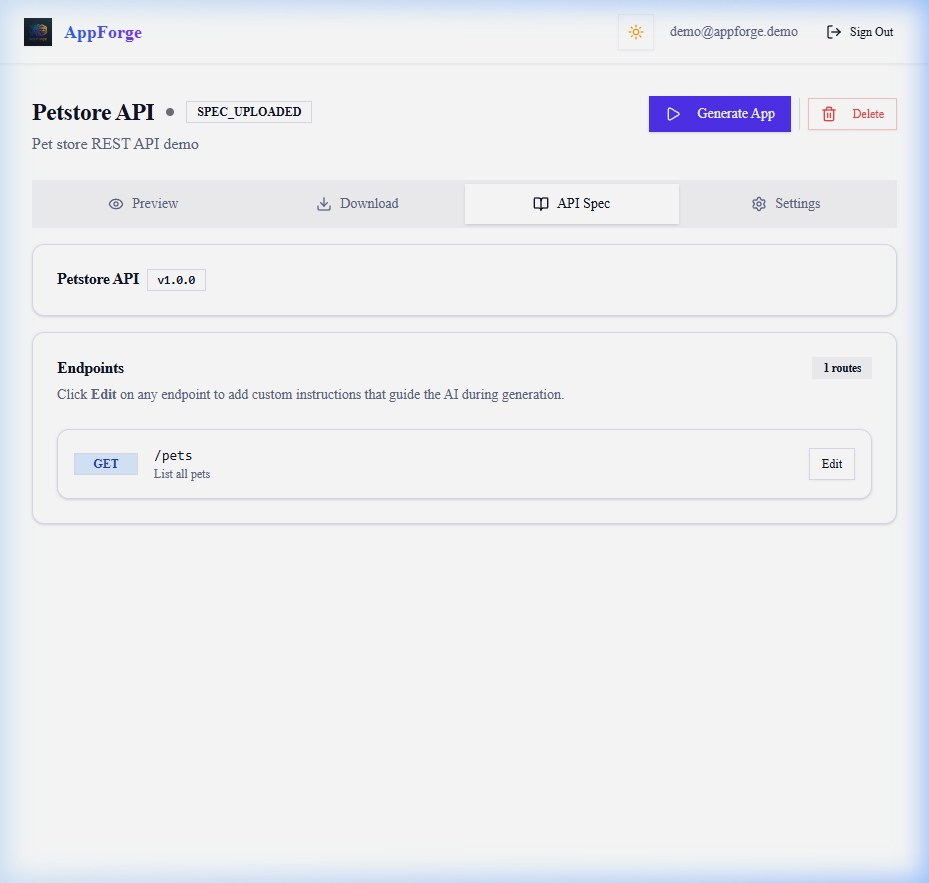

# AppForge (formerly API-to-App Generator)

**🌐 Live Demo:** [https://appforge.thognard.net/](https://appforge.thognard.net/)

AppForge is a powerful, AI-driven platform that instantly transforms raw OpenAPI Specifications into fully functional, stunning, and deployable Next.js applications.

By simply uploading a `swagger.json` or `openapi.yaml`, AppForge's intelligent generation engine parses the endpoints and uses advanced Large Language Models to write a complete frontend architecture—including API clients, state management, and beautiful UI components—specifically tailored to interact with your target API.



## ✨ Features

- **Instant App Generation:** Upload an OpenAPI spec and get a working Next.js App Router application in minutes.
- **AI-Powered Architecture:** Uses leading LLMs (like GPT-4o or Claude 3.5 Sonnet) to intuitively design and write standard React code.
- **Endpoint Enrichment:** Add custom English instructions or business rules to specific API endpoints before generation to guide the AI's logic.
- **Live Preview:** Instantly preview the generated application running in a sandboxed Next.js server directly within the dashboard.
- **Code Export:** Download the fully generated source code as a `.zip` file, ready to be deployed to Vercel or your infrastructure.
- **Premium UI/UX:** A stunning, vibrant dark/light native UI featuring glass-morphism and smooth animations.

---

## 🛠️ Tech Stack & Packages Used

AppForge is built to be modern, fast, and scalable. Here is a breakdown of the core technologies powering the platform:

### 1. Core Framework

- **[Next.js 14 (App Router)](https://nextjs.org/):** The foundation of the platform. We utilize React Server Components for robust data fetching and enhanced security, and standard Client Components for dynamic dashboard interactivity.
- **[React 18](https://react.dev/):** Provides the component-driven architecture for both the AppForge generator and the applications it creates.

### 2. Styling & UI Design System

- **[Tailwind CSS](https://tailwindcss.com/):** For rapid, utility-first styling and creating the custom AppForge HSL gradient color palette.
- **[Shadcn UI](https://ui.shadcn.com/):** A collection of highly customizable, accessible components. Used extensively for Dialogs, Dropdowns, Forms, and Cards.
- **[Lucide React](https://lucide.dev/):** A beautiful, consistent icon set used throughout the dashboard.
- **[Next-Themes](https://github.com/pacocoursey/next-themes):** Seamless, flicker-free dark/light mode switching hooked directly into Tailwind's dark class system.

### 3. Database & Authentication

- **[Prisma ORM](https://www.prisma.io/):** Type-safe database client. We use Prisma to manage User accounts, Projects, OpenAPI specs, and Enrichment rules.
- **[SQLite](https://sqlite.org/):** The default lightweight database for easy local setup, though Prisma can be trivially swapped to PostgreSQL.
- **[NextAuth.js (Auth.js)](https://next-auth.js.org/):** Secure, credential-based authentication system safeguarding user projects and generations.

### 4. AI & Integration Logic

- **[OpenAI SDK](https://github.com/openai/openai-node):** The primary client used to communicate with LLMs. We leverage strict system prompts, context injection, and strict output requirements to force the model to write valid, deployable App Router code.
- **[Zod](https://zod.dev/):** TypeScript-first schema declaration used heavily in Next.js Server Actions to securely validate user inputs before hitting the database.

---

## 🧠 How It Works (The Generation Pipeline)

1. **Parsing Phase:** When a user uploads an OpenAPI spec, AppForge parses the YAML/JSON to extract available endpoints, methods, parameters, and descriptions.
2. **Context Injection Phase:** The user has the opportunity to add custom "Enrichments" to specific endpoints, and supply target API authentication keys (which are securely injected into the generated app's `.env.local` file).
3. **Prompt Engineering:** The `GeneratorService` builds a massive, highly-specific system prompt. It enforces strict Next.js App Router rules (e.g., proper usage of `"use client"`, avoiding `next/image` for dynamic external URLs, and using bracket notation for environment variables).
4. **LLM Execution:** The context is sent to the LLM (GPT-4o or Claude 3.5 Sonnet highly recommended for complex syntax reliability). The LLM responds with a structured block of code containing every single file required for the application.
5. **File Hydration:** AppForge intercepts the LLM output, splits it into localized files within a secure `projects/{id}/generated` directory, and actively overwrites the `package.json` and `next.config.mjs` to inject failsafes and ensure the generated app doesn't crash the Node process.
6. **Live Preview:** A dynamic API route allows the user to spin up an independent Next.js preview server executing against the generated folder, proxying the output directly to an iframe in the dashboard.

---

## 🛡️ Security & Hardening (OWASP Standards)

AppForge takes security seriously. The platform's architecture acts dynamically on raw user input and large parsing payloads. To mitigate injection and exhaustion vectors, the following robust defenses have been implemented across the backend server actions:

1. **SQL Injection (SQLi) Prevention:** All form mutations implicitly compile through Prisma ORM to rigorously enforced parameterized SQL queries. There are zero instances of dynamic raw SQL execution.
2. **Cross-Site Scripting (XSS) Mitigation:** The Next.js React component tree has been audited to strictly rely on native JSX variable auto-escaping. There is zero usage of `dangerouslySetInnerHTML`, effectively neutralizing rogue payload executions generated from untyped LLM output or OpenAPI files.
3. **Payload DoS & Memory Exhaustion Restrictions:** AppForge employs rigorous `Zod` schema boundaries. All Next.js Server Actions enforce stringent character limits (`.max()`) on database writes (including passwords, tokens, API properties, etc.), and file uploads enforce a rigid cap of **5MB** prior to triggering V8 memory buffer streaming.

---

## 📖 User Guide

### 1. Create a New Project
Begin by navigating to the Dashboard and clicking the **"New Project"** button in the top right corner. Give your project a descriptive name and summary.



### 2. Upload OpenAPI Specification
Once inside your newly created project, upload a valid JSON or YAML **OpenAPI 3.0+ Specification**. This definition acts as the absolute source of truth that the AI will use to generate the React components, network layers, and forms.

### 3. Enrich and Configure AI
AppForge parses your specification and displays all valid REST endpoints. You can inject custom instructions into specific API paths to forcefully guide the AI's rendering logic.

Finally, select your target LLM in the Configuration panel. We strongly recommend using high-parameter models like **Claude 3.5 Sonnet** or **GPT-4o** for robust Next.js generation.



### 4. Generate, Preview, and Download
Click **Generate Application**. AppForge will efficiently minify your spec to conserve tokens, compile an extensive system prompt covering complex framework routing rules, and execute the completion.

Once finished, you can test the application dynamically via the built-in isolated sandbox preview. However, for a complete lag-free experience, it is heavily recommended to click **Download Code** and launch the repository natively via `npm run dev`.

---

## 🚀 Getting Started

### Prerequisites

- Node.js 18.17+
- npm or pnpm
- An OpenAI or OpenRouter API Key

### Installation

1. Clone the repository:
   ```bash
   git clone https://github.com/drangoht/ApiToAppGenerator.git
   cd ApiToAppGenerator
   ```

2. Install dependencies:
   ```bash
   npm install
   ```

3. Set up your environment variables:
   Copy the example environment file and insert your API keys and Auth secrets.
   ```bash
   cp .env.example .env
   ```

4. Initialize the database:
   ```bash
   npx prisma db push
   npx prisma generate
   ```

5. Start the development server:
   ```bash
   npm run dev
   ```

### Running with Docker (Local Development)

AppForge includes a production-ready `docker-compose` setup that packages the Next.js App Router and maintains persistent local volumes out of the box.

1. Make sure Docker Desktop is installed and running on your machine.
2. Build and start the container:
   ```bash
   docker-compose up --build
   ```
3. The platform will automatically boot up and become accessible on port 3000.
4. To safely stop the container when you are done:
   ```bash
   docker-compose down
   ```

### Deploying to a Remote Server (Production Docker)

To deploy AppForge to a remote server without pulling the full source code, you can use the pre-built Docker image and a minimal `docker-compose.yml` file.

1. **Connect to your Server** and create a deployment directory:
   ```bash
   mkdir -p ~/appforge/prisma
   mkdir -p ~/appforge/projects
   cd ~/appforge
   ```

2. **Set Ownership Permissions:**
   The Docker container runs as a strict, non-root user (`nextjs`, UID 1001) for security. You must grant this user ownership of the mounted directories so the container can write to the database and generate projects:
   ```bash
   sudo chown -R 1001:1001 ~/appforge/prisma ~/appforge/projects
   ```

3. **Initialize the Database File:**
   Docker requires the SQLite file to exist *before* mounting it, otherwise it creates a directory instead. Create an empty file, and ensure it is owned by the `nextjs` user:
   ```bash
   sudo -u \#1001 touch ~/appforge/prisma/dev.db
   ```

4. **Create the `docker-compose.yml` File:**
   Create a `docker-compose.yml` inside the `appforge` directory:
   ```yaml
   services:
     appforge:
       image: drangoht/appforge:latest
       container_name: appforge_web
       ports:
         - "3000:3000"
       environment:
         - NODE_ENV=production
         - AUTH_TRUST_HOST=true
         - AUTH_SECRET=your_super_secret_production_key_here
         - DATABASE_URL=file:./dev.db
         # - OPENAI_API_KEY=your_openai_key_here
       volumes:
         - ./prisma/dev.db:/app/prisma/dev.db
         - ./projects:/app/projects
       restart: unless-stopped
   ```

5. **Start the Application:**
   Pull the latest image and start the container in detached mode:
   ```bash
   docker-compose up -d
   ```
   The container will automatically apply the Prisma database schema and boot up the Next.js server on port 3000.

---

Open [http://localhost:3000](http://localhost:3000) with your browser to see the result. Register an account and start forging applications!
