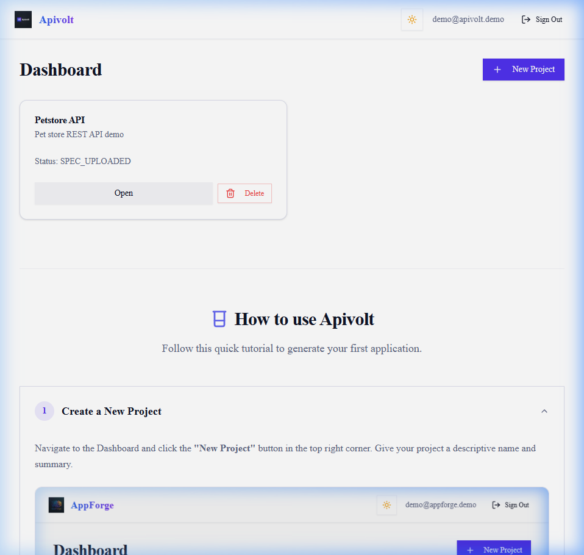
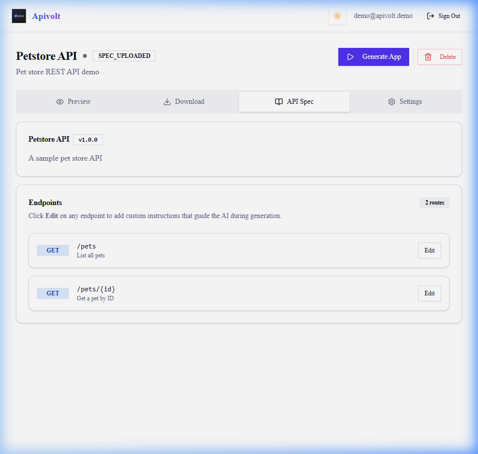
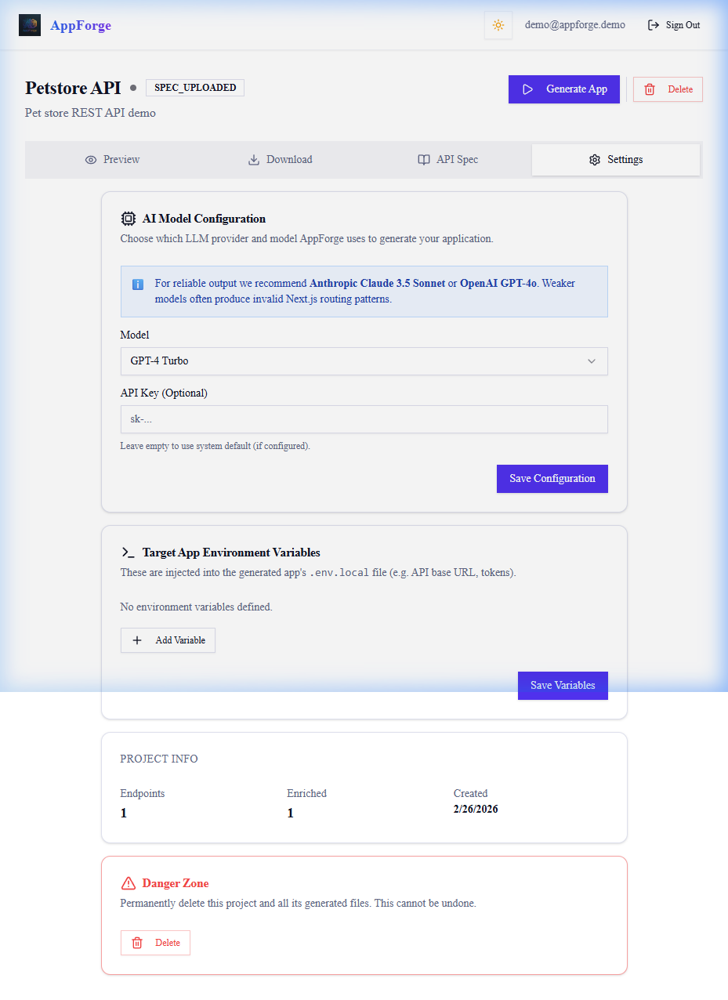
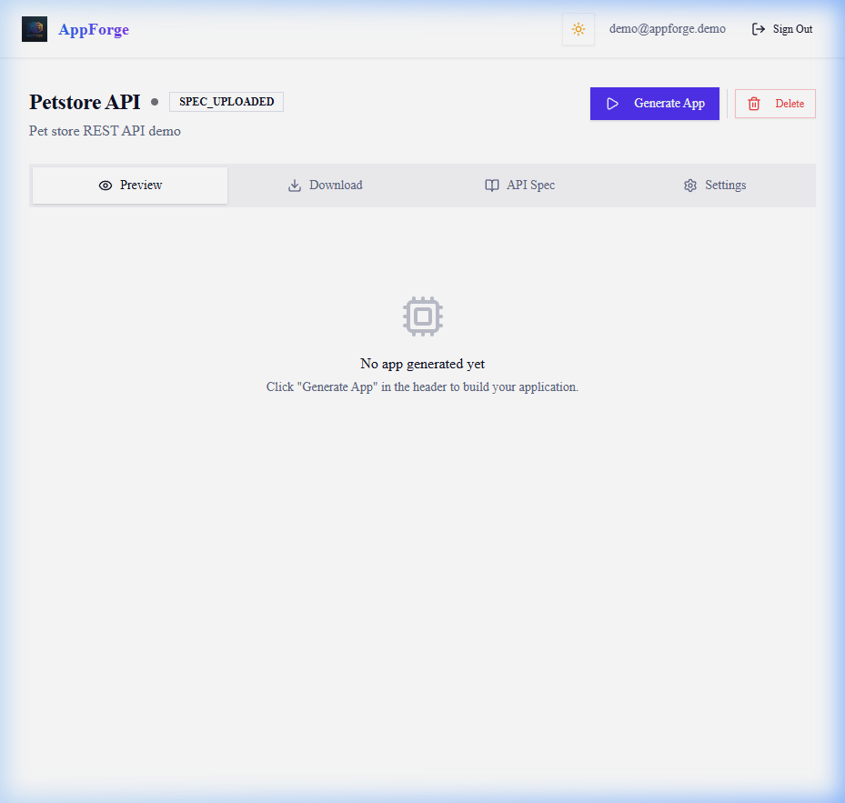
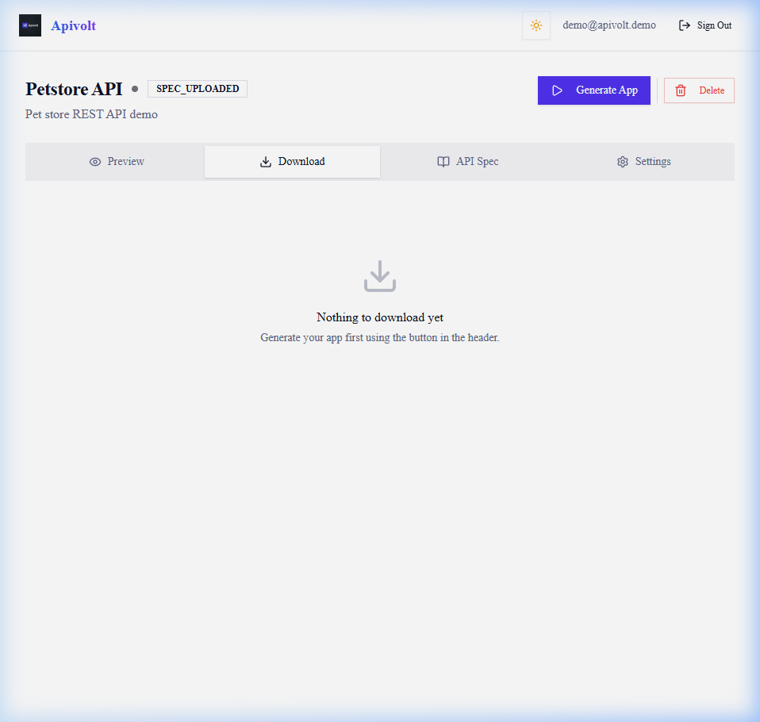

# Apivolt

**🌐 Live Demo:** [https://Apivolt.thognard.net/](https://Apivolt.thognard.net/)

Apivolt is an AI-driven meta-generator that transforms OpenAPI specifications into fully functional, deployable Next.js applications. Upload a `swagger.json` or `openapi.yaml` — or point it at a documentation URL — and Apivolt generates a complete frontend with API clients, state management, and a polished UI tailored to your target API.



---

## Features

- **Instant App Generation** — Upload an OpenAPI spec and receive a working Next.js 14 App Router application in minutes.
- **Crawl from URL** — No spec file? Paste a documentation URL and Apivolt will BFS-crawl up to 20 pages, then synthesise a full OpenAPI spec from the scraped content using an LLM.
- **Endpoint Enrichment** — Add custom instructions to individual API endpoints before generation to guide the AI's logic for that route.
- **Multi-Provider LLM Support** — Works with any OpenAI-compatible model. Models prefixed with `openrouter/` are automatically routed through OpenRouter, giving access to Claude, Gemini, Llama, and more.
- **Live Preview** — Launch the generated app in a sandboxed Next.js dev server and view it in an iframe directly in the dashboard.
- **Public Share Link** — Share a public URL for the live preview without requiring the viewer to log in.
- **One-Click Export** — Download the full generated source as a `.zip`, ready to run locally or deploy to Vercel.

---

## Tech Stack

### Platform (Apivolt itself)

| Layer | Technology |
|---|---|
| Framework | [Next.js 16](https://nextjs.org/) App Router + [React 19](https://react.dev/) |
| Styling | [Tailwind CSS](https://tailwindcss.com/) + [Shadcn UI](https://ui.shadcn.com/) |
| Animations | [Framer Motion](https://www.framer.com/motion/) |
| Icons | [Lucide React](https://lucide.dev/) |
| Toasts | [Sonner](https://sonner.emilkowal.ski/) |
| Theme | [next-themes](https://github.com/pacocoursey/next-themes) — flicker-free dark/light mode |
| Database | [SQLite](https://sqlite.org/) via [Prisma ORM](https://www.prisma.io/) |
| Auth | [NextAuth.js v5](https://authjs.dev/) — credentials provider, bcrypt hashed passwords |
| LLM Client | [OpenAI SDK v6](https://github.com/openai/openai-node) — OpenAI + OpenRouter |
| Validation | [Zod v4](https://zod.dev/) — all server action inputs |
| Forms | [React Hook Form](https://react-hook-form.com/) |
| Web Crawling | [Cheerio](https://cheerio.js.org/) |
| Archiving | [archiver](https://github.com/archiverjs/node-archiver) |
| Testing | [Vitest](https://vitest.dev/) |

### Generated Applications

Every app Apivolt generates targets **Next.js 14 App Router + TypeScript + Tailwind CSS + Shadcn UI**, pinned to stable versions to ensure consistent builds.

---

## How It Works

1. **Parse** — The uploaded YAML/JSON spec is validated and normalised. A minifier strips descriptions and examples to reduce token count before sending to the LLM.
2. **Enrich** — Per-endpoint instructions added by the user are injected into the prompt, along with target API base URL and auth headers.
3. **Prompt** — `GeneratorService` builds a structured system + user prompt, instructing the LLM to delimit every file with `<<<FILE:path>>>…<<<END>>>`.
4. **Generate** — The prompt is sent to the configured LLM (OpenAI or OpenRouter). Generation is fire-and-forget; the client polls for status.
5. **Hydrate** — `GeneratedProjectWriter` parses the delimited blocks, writes them to `projects/<id>/generated/`, then enforces stable `package.json` pins, a safe `next.config.mjs`, and injects target API env vars into `.env.local`.
6. **Preview** — `PreviewManager` spawns `npm install` then `next dev` for the generated project. The main app's middleware reverse-proxies `/preview/:port/:projectId/…` into an iframe.

---

## Architecture

For a deep dive into Prisma models, the generation pipeline, preview sandbox, proxy middleware, and CI/CD setup, see [ARCHITECTURE.md](./ARCHITECTURE.md).

---

## Security

- **SQL Injection** — All mutations go through Prisma parameterised queries. No raw SQL.
- **XSS** — No `dangerouslySetInnerHTML`. All LLM and user content rendered through React's standard JSX escaping.
- **Input validation** — Every server action enforces Zod schemas with character limits on all DB writes. File uploads are capped at 5 MB.
- **Auth guard** — The Next.js middleware (`src/proxy.ts`) redirects unauthenticated requests away from `/dashboard` before they reach any server component or action.
- **Container hardening** — The Docker image runs as a non-root user (`nextjs`, UID 1001).

---

## User Guide

### 1. Create a Project

Go to the **Dashboard** and click **New Project**. Give it a name and optional description.

### 2. Add an OpenAPI Spec

**Option A — Upload a file:** In the **API Spec** tab, upload a `.json` or `.yaml` OpenAPI 3.0+ file.

**Option B — Crawl from URL:** Paste a documentation URL and click **Crawl**. Apivolt will BFS-crawl up to 20 pages and synthesise the spec automatically.



### 3. Enrich Endpoints & Configure Settings

In the **API Spec** tab, click **Edit** on any endpoint to add custom generation instructions.

In the **Settings** tab, select your LLM and optionally add per-project API keys and target API environment variables.



> **Recommended models:** `claude-sonnet-4-6` (via OpenRouter) or `gpt-4o` for complex Next.js generation.

### 4. Generate

Click **Generate App**. Status updates to `GENERATING` and the client polls until `READY` or `ERROR`.

### 5. Preview

Open the **Preview** tab to launch the sandboxed dev server and view the running app in an iframe. Use **Share Link** for a public URL.



### 6. Download & Run Locally

Click the **Download** tab for a one-click ZIP export.



```bash
unzip MyProject_generated.zip -d my-app
cd my-app
npm install
npm run dev
```

---

## Getting Started

### Prerequisites

- Node.js 18.17+
- npm
- An OpenAI or OpenRouter API key

### Local Setup

```bash
# 1. Clone
git clone https://github.com/drangoht/ApiToAppGenerator.git
cd ApiToAppGenerator

# 2. Install dependencies
npm install

# 3. Create .env
cat > .env << 'EOF'
DATABASE_URL="file:./dev.db"
AUTH_SECRET="replace-with-a-random-secret"
# Optional — can be configured per-project in the UI instead:
# OPENAI_API_KEY="sk-..."
# OPENROUTER_API_KEY="sk-or-..."
EOF

# 4. Initialise the database
npx prisma migrate dev

# 5. Start
npm run dev
```

Open [http://localhost:3000](http://localhost:3000), register an account, and start generating.

---

### Docker (Local)

```bash
docker-compose up --build
```

The app starts on port 3000. Stop with `docker-compose down`.

---

### Docker (Remote / Production)

Deploy from the pre-built image — no source code required.

**1. On your server, create the deployment directory:**

```bash
mkdir -p ~/Apivolt/prisma ~/Apivolt/projects
cd ~/Apivolt
```

**2. Grant ownership to the container's non-root user (UID 1001):**

```bash
sudo chown -R 1001:1001 ~/Apivolt/prisma ~/Apivolt/projects
```

**3. Pre-create the SQLite file** (Docker mounts a directory instead of a file if the target doesn't exist):

```bash
sudo -u \#1001 touch ~/Apivolt/prisma/dev.db
```

**4. Create `docker-compose.yml`:**

```yaml
services:
  apivolt:
    image: drangoht/apivolt:latest
    container_name: apivolt_web
    ports:
      - "3000:3000"
      - "3100-3110:3100-3110"
    environment:
      - NODE_ENV=production
      - AUTH_TRUST_HOST=true
      - AUTH_SECRET=replace-with-a-random-secret
      - DATABASE_URL=file:./dev.db
      # Optional global API keys (can also be set per-project in the UI):
      # - OPENAI_API_KEY=sk-...
      # - OPENROUTER_API_KEY=sk-or-...
    volumes:
      - ./prisma/dev.db:/app/prisma/dev.db
      - ./projects:/app/projects
    restart: unless-stopped
```

**5. Start:**

```bash
docker-compose up -d
```

The container applies the Prisma schema on boot and listens on port 3000.

---

## Contributing

Issues and PRs are welcome. Run `npm run test` before submitting.
